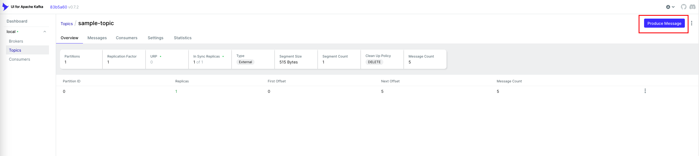

# Kafka Sample

This project exemplifies an integration between Spring and Kafka, through a consumer and a producer of messages.

### Stack
- Java 21
- Spring Boot 3.4.
- Docker
- Kafka

### Getting started
1. Run the [docker-compose.yml](docker-compose.yml) file to start services (kafka).
2. Run the application.
3. You can send a message through the **POST /sample-message/send** endpoint
```
curl --location 'localhost:8080/sample-message/send' \
--header 'Content-Type: application/json' \
--data '{
"message":"Sample request message"
}'.
```
   
4. You can also send messages in the [kafka-ui](http://localhost:8050/).
5. See the message being produced and consumed in your IDE console log.

### Kafka
Three services will be started once docker compose is run:

- zookeeper (node control, permissions, topic/partition config...)
- kafka (consumer groups, logs, offset...)
- kafka-ui (Web UI to manage kafka)

In the Kafka UI you can send messages to the given topic.



*It will be available on http://localhost:8050 once docker is running.*